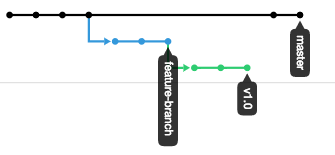
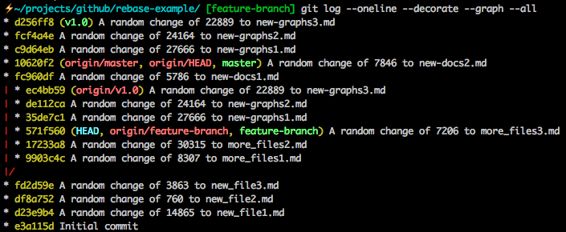

# rebase-example
A very simple repo to demonstrate rebasing with "rebase onto"

Showing how you can move one branch that was branched off incorrectly from another feature branch back onto master as its base. 

### Steps Taken to Demonstrate
1. Branched the `feature-branch` branch (repetitive, I know) off of the master branch
2. Created a few commits on the `feature-branch`
3. Branched the `v1.0` branch from `feature-branch` (this would be an example of someone inadvertantly branching off of the wrong branch)
4. Added some commits to the `v1.0` branch.
5. Realized the `v1.0` branch was in the wrong location. 
6. Removed it from the `feature-branch` by using the `git rebase --onto` command. This is the executed command:
  - `git rebase --onto master feature-branch v1.0`
7. The commits on the v1.0 branch are not appended to the master branch

Branches Before the Rebase:

Branches After the Rebase:

